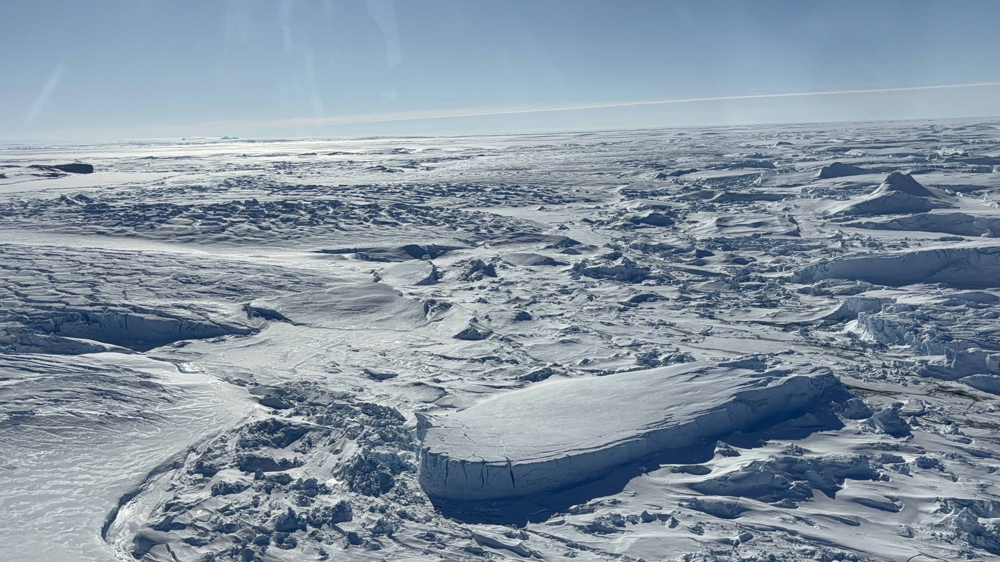

Hello Everyone, I'm a geophysicist at CSIRO. My research interests include linking geophysics and petrophysics to understand natural resources, tectonics, and earth systems. I am also intersted in using geophysical data to improve our understanding of Antarctic lithosphere structure and its related land-ice-ocean interaction processes.

